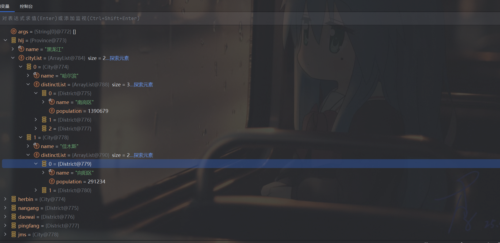
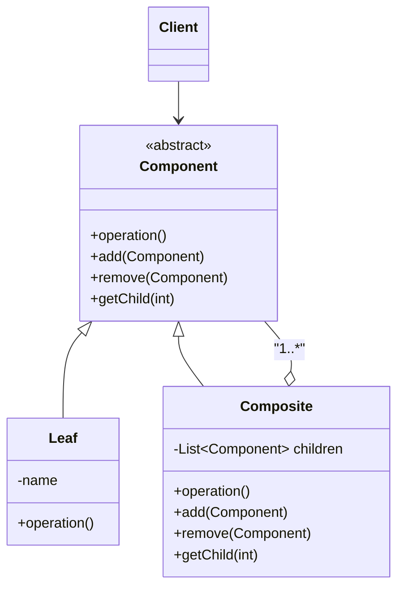

对应代码在composite_population包下



好的，我们来详细介绍一下“组合模式”（Composite Pattern）。

### 1. 核心思想：像搭积木一样处理对象

组合模式的核心思想是：**将对象组合成树形结构，以表示“部分-整体”的层次结构。它使得客户端可以统一地处理单个对象（叶子节点）和由多个对象组成的组合对象（树枝节点）。**

简单来说，无论你面对的是一个单独的士兵，还是一个由多个士兵、小队、分队组成的整个军团，你都可以用同样的方式下达命令（比如“前进！”）。你不需要关心这个命令是发给单个士兵，还是发给一个复杂的军团。

---

### 2. 生活中的比喻：文件夹系统

理解组合模式最经典的例子就是电脑里的文件夹系统：

*   **文件（File）**: 这就像一个“叶子对象”（Leaf）。它是一个独立的基本单位，不能再包含其他文件或文件夹。你可以对它进行操作，比如“复制”、“删除”、“重命名”。
*   **文件夹（Folder）**: 这就像一个“组合对象”（Composite）。它本身可以包含多个文件，也可以包含其他文件夹（形成嵌套）。你也可以对文件夹进行同样的操作，比如“复制”、“删除”、“重命名”。当你对一个文件夹执行“删除”操作时，它内部所有的文件和子文件夹都会被一并删除。

你会发现，无论你操作的是单个文件还是整个文件夹，你使用的方式（右键菜单、拖拽等）都是一样的。这就是组合模式的精髓：**提供一个统一的接口来处理个体和整体**。

---

### 3. 模式的组成角色

组合模式通常包含以下三个角色：

1.  **抽象组件（Component）**:
    *   这是一个接口或抽象类，为组合中的所有对象（叶子和组合对象）定义了统一的操作。
    *   例如，在文件夹系统中，这个角色会定义 `display()`（显示名称）、`getSize()`（获取大小）等方法。
    *   它还可以包含管理子组件的方法，如 `add()`、`remove()`、`getChild()`。

2.  **叶子节点（Leaf）**:
    *   表示树形结构中的末端对象，它没有子节点。
    *   它实现了抽象组件的所有操作。
    *   对于管理子节点的方法（如 `add`, `remove`），叶子节点通常会直接抛出异常或不做任何处理，因为它不能有子节点。
    *   例如：文件（File）。

3.  **组合节点（Composite） / 树枝节点**:
    *   表示树形结构中拥有子节点的非末端对象。
    *   它也实现了抽象组件的所有操作。
    *   它的特殊之处在于，它内部通常会持有一个子组件的集合（比如一个 `List<Component>`）。
    *   当对它执行某个操作时（如 `display()`），它不仅会处理自身，还会递归地调用其所有子组件的相同方法。
    *   例如：文件夹（Folder）。

### 4. UML 结构图


*   **Client** 通过 **Component** 接口与整个树形结构交互。
*   **Composite** 内部包含一个 **Component** 列表，实现了“部分-整体”的聚合关系。
*   **Leaf** 和 **Composite** 都继承自 **Component**，确保它们有统一的行为。

---

### 5. Java 代码示例（以公司组织架构为例）

假设我们要表示一个公司的组织架构，公司下有部门，部门下有员工。无论是公司、部门还是员工，我们都想能统一地显示他们的信息。

**第1步：定义抽象组件（OrganizationComponent）**

```java
// 抽象组件：组织
public abstract class OrganizationComponent {
    private String name;
    private String description;

    public OrganizationComponent(String name, String description) {
        this.name = name;
        this.description = description;
    }

    // 管理子组件的方法，叶子节点不需要实现，所以提供默认实现（抛出异常）
    public void add(OrganizationComponent organizationComponent) {
        throw new UnsupportedOperationException();
    }

    public void remove(OrganizationComponent organizationComponent) {
        throw new UnsupportedOperationException();
    }
    
    // 统一的操作方法，由子类实现
    public abstract void print();

    // Getter and Setter
    public String getName() {
        return name;
    }
    public void setName(String name) {
        this.name = name;
    }
    // ... 其他 getter/setter
}
```

**第2步：创建叶子节点（Employee）**

```java
// 叶子节点：员工
public class Employee extends OrganizationComponent {

    public Employee(String name, String description) {
        super(name, description);
    }

    @Override
    public void print() {
        System.out.println("  -- " + getName() + " (" + getDescription() + ")");
    }
}
```
*注意：Employee继承了`add`和`remove`方法，但使用的是父类的默认实现（抛出异常），因为它不能有下属。*

**第3步：创建组合节点（Department）**

```java
import java.util.ArrayList;
import java.util.List;

// 组合节点：部门/公司
public class Department extends OrganizationComponent {
    // 存储子组件的集合
    private List<OrganizationComponent> children = new ArrayList<>();

    public Department(String name, String description) {
        super(name, description);
    }

    @Override
    public void add(OrganizationComponent organizationComponent) {
        children.add(organizationComponent);
    }

    @Override
    public void remove(OrganizationComponent organizationComponent) {
        children.remove(organizationComponent);
    }

    @Override
    public void print() {
        System.out.println("--- " + getName() + " (" + getDescription() + ") ---");
        // 递归打印所有子节点
        for (OrganizationComponent component : children) {
            component.print();
        }
    }
}
```

**第4步：客户端调用**

```java
public class Client {
    public static void main(String[] args) {
        // 创建顶层公司
        OrganizationComponent company = new Department("未来科技集团", "全球领先的科技公司");

        // 创建部门
        OrganizationComponent hrDepartment = new Department("人力资源部", "负责招聘和员工管理");
        OrganizationComponent techDepartment = new Department("技术研发部", "负责产品研发");

        // 创建员工
        OrganizationComponent emp1 = new Employee("张三", "HR专员");
        OrganizationComponent emp2 = new Employee("李四", "资深Java工程师");
        OrganizationComponent emp3 = new Employee("王五", "前端架构师");
        OrganizationComponent emp4 = new Employee("赵六", "产品经理");

        // 构建组织架构
        hrDepartment.add(emp1);
        techDepartment.add(emp2);
        techDepartment.add(emp3);
        techDepartment.add(emp4);
        
        company.add(hrDepartment);
        company.add(techDepartment);

        // 统一调用print方法，打印整个公司的层级结构
        company.print();
    }
}
```
**输出结果：**
```
--- 未来科技集团 (全球领先的科技公司) ---
--- 人力资源部 (负责招聘和员工管理) ---
  -- 张三 (HR专员)
--- 技术研发部 (负责产品研发) ---
  -- 李四 (资深Java工程师)
  -- 王五 (前端架构师)
  -- 赵六 (产品经理)
```
可以看到，我们只调用了顶层对象`company.print()`，就递归地打印出了整个复杂的组织结构。客户端完全不需要关心它处理的是一个部门还是一个员工。

---

### 6. 优缺点

**优点：**

1.  **简化客户端代码**：客户端可以一致地使用组合结构中的所有对象，无需区分叶子和组合节点，这使得代码更加简单和易于维护。
2.  **易于扩展**：可以很方便地增加新的组件类型（新的叶子或组合节点），只要它们实现了共同的接口即可，符合开闭原则。
3.  **天然表示树形结构**：非常适合用来表示具有层次结构的数据，如菜单、UI控件、组织架构等。

**缺点：**

1.  **设计变得更通用，也更模糊**：因为叶子节点和组合节点都实现了相同的接口，但叶子节点可能并不支持某些操作（如`add`, `remove`）。这可能导致在运行时抛出异常，违反了接口隔离原则。这种设计被称为“透明方式”，虽然对客户端透明，但对组件自身不安全。
    *   （*注：另一种设计是“安全方式”，即只在Composite类中定义`add`/`remove`方法，这样更安全，但客户端需要进行类型判断，失去了透明性。*）
2.  **限制了组件类型**：所有组件都必须继承自同一个抽象基类或实现同一个接口，这在某些情况下可能不够灵活。

### 7. 适用场景

当你遇到以下情况时，可以考虑使用组合模式：

*   你想表示对象的“部分-整体”层次结构。
*   你希望客户端能够忽略组合对象与单个对象的不同，统一地使用结构中的所有对象。
*   系统中的对象可以被组织成树形结构，并且你希望对整个树或树的一部分进行统一的操作。

**常见应用：**

*   **GUI 控件**：窗口（Composite）可以包含面板（Composite），面板可以包含按钮（Leaf）、文本框（Leaf）等。
*   **文件系统**：文件夹（Composite）和文件（Leaf）。
*   **组织架构**：公司（Composite）、部门（Composite）和员工（Leaf）。
*   **菜单系统**：菜单（Composite）可以包含子菜单（Composite）或菜单项（Leaf）。